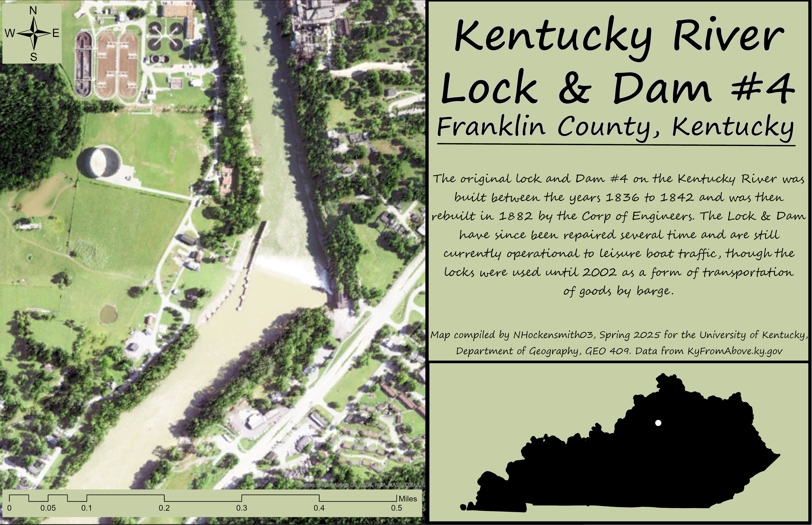
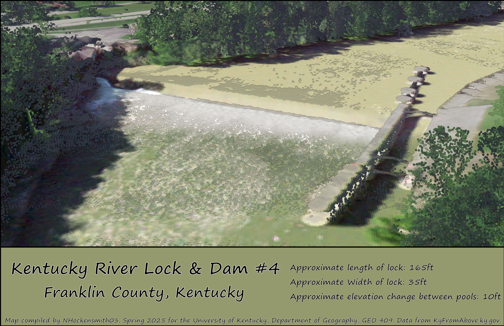

<head>
  <meta charset="utf-8" />
  <title>Presentation</title>
  <meta name="viewport" content="initial-scale=1,maximum-scale=1,user-scalable=no" />
  <link rel="preconnect" href="https://fonts.googleapis.com" />
  <link rel="preconnect" href="https://fonts.gstatic.com" crossorigin />
  <link href="https://fonts.googleapis.com/css2?family=Open+Sans:wght@400;800&display=swap" rel="stylesheet" />
  
</head>

<body>
  <section>
    <!-- 💡💡💡 Cesium map: paste embed code below -->
    <iframe title="KyRivLoc4" width="1024" height="576" src="https://ion.cesium.com/stories/viewer/?id=81198725-83d1-423c-84cb-33141159165e" frameborder="0" allow="fullscreen" allowfullscreen="true" mozallowfullscreen="true" webkitallowfullscreen="true"></iframe>
    <!-- 💡💡💡 Cesium map: paste embed code above -->
    
Above is an 3D tour of the Kentucky River Lock & Dam #4 

    

      <h1>Kentukcy River Lock & Dam #4</h1>
      <h2>Frankfort, Kentucky</h2>
    

    

      

        <h3>Left Column - Description</h3>
        

          The original lock and Dam #4 on the Kentucky River was built between the years 1836 to 1842 and was then rebult in 1882 by the Corp of Engineers. The Lock & Dam have since been repaired several time and are still currently operational to leasure boat traffic, though the locks were used until 2002 as a form of transportation of goods by barge.
        

        

          The goal of this project is to take a look at a piece of infustructure that played a role in the growth of kentucky. The lock system throughout the kentucky river played a viable role in transportation of good in and out of the state. 
        

        

          Visualizations created from lidar data provided by
          <a href="https://kyfromabove.ky.gov/">KyFromAbove</a> in ArcGIS Pro, Blender, and Cesium Ion. Additional sources of information from
          <a href="https://finance.ky.gov/kentucky-river-authority/Documents/2_Intro_Ky_River_Trans_Route.pdf">Kentucky.gov</a>, and
          <a href="https://finance.ky.gov/kentucky-river-authority/Pages/lock-and-dam-4.aspx#:~:text=Lock%20and%20Dam%204%20were,original%20lock%20was%20stone%20masonry.">Kentucky River Authority</a>, April, 2025.
        

        

          Page and visualizations created by NHockensmith for GEO 409, Department of
          Geography, University of Kentucky. Spring 2025.
        

      

      

        <h3>Shaded Relief </h3>
        
        
This map displays a shaded releif of the area around Lock #4 <a href="KyRivShadeRelief.pdf">(High-Resolution Version)</a>

        <h3>Point Cloud from Lidar </h3>
      
        
This map the size of the lock determined from lidar data being displayed as a colorized point cloud. <a href="KyRivLoc4_Map.pdf">(High-Resolution Version)</a>

      

    

  </section>
  <footer>
    

    
  </footer>
</body>
